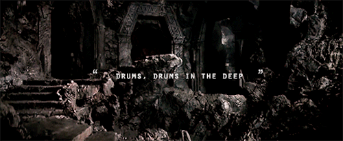

# The Mines of MIDIa

## Goal

The goal of this project was to create a virtual drumset that reads a midi file and plays it back in real time on a graphical 
drumset, as well as producing the sheet music directly from the midi file. 

## Intellectual Property

The Mines of MIDIa falls is licensed under the [GNU General Public License, version 3 (GPLv3)](#).

[Midi.js](https://galactic.ink/midi-js/) falls under it's own licensing which can be found in the link provided. We would like to 
thank the creators of Midi.js for letting us use their product. It was crucial to this project, and wouldn't have been possible 
without it given the time frame.

## Other Thoughts

We have also implgit add -A
emented a user login/signup system to allow users to upvote or downvote a midi file. This ensures that users
are learning accurate drum parts by hoisting the most popular versions up. This product also allows users to create their own midi files
and upload them for others to learn. 

## Screen Shots

## Creators

- Brody Concannon
- Nathan Karasch
- Stefan Kraus
- Gregory Steenhagen

