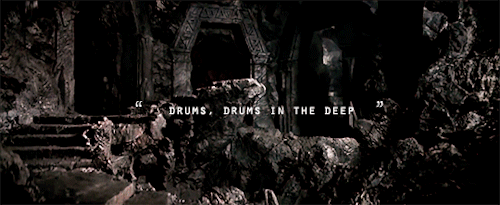

# The Mines of MIDIa

> "Drums, drums in the deep..."

## Goal

The Mines of MIDIa is a web application that helps individuals
learn to play drums. It will feature the ability to play MIDI
files while seeing a graphical representation of the drums being
played. The graphical representation will be in two parts:

1. a drum set image that lights up the different drums as the
   music plays, and
2. a music staff that shows the notes in traditional music notation.

## Screenshots

Coming soon...

## Discussion

This project will be broken up into two separate projects due to
time constraints. The first part of the project, will be mainly
user interface stuff, like login, profile stuff, songs, etc. The
second half will contain more midi parsing stuff.

There isn't any very good midi file libraries that we can use, so
one restriction we might want to set is that users must upload
their own midi files. To do this, we might want to implement a
voting or rating system, so people can upvote midi files that are
actually accurate. This would prevent people from uploading a midi
file and claiming that it is actually a different song.

## Intellectual Property

The Mines of MIDIa falls is licensed under the [GNU General Public License, version 3 (GPLv3)](#).

## Other Thoughts

Coming soon...

## Creators

International Justice League of Super Acquaintances

- Brody Concannon
- Nathan Karasch
- Stefan Kraus
- Gregory Steenhagen

