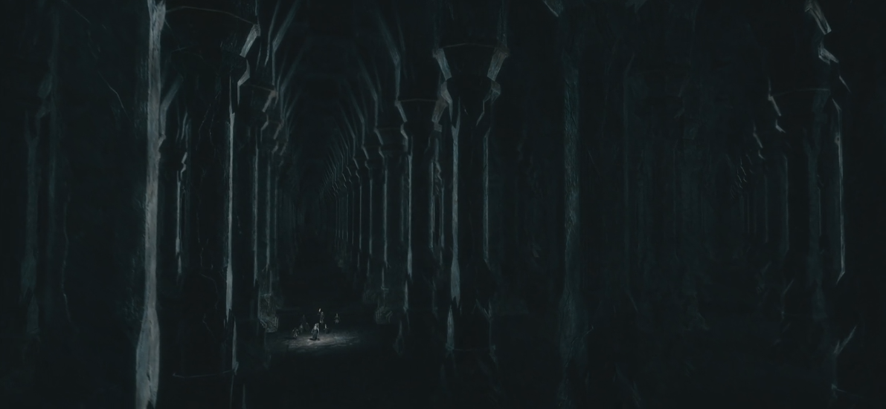

## Mines of MIDIA
### "Drums, Drums in the deep."

Mines of Midia is a user interface for parsing the drum part out of a midi file and displaying it on a graphical drumset.

This project will be broken up into two separate projects due to time constraints. The first part of the project, will be mainly user interface
stuff, like login, profile stuff, songs, etc. The second half will contain more midi parsing stuff. 

## Deliverables

The goals of this project are as follows

- To allow users to login/create an account
- Search for songs
- View most popular tracks
- Upload Midi Files

The goals for the second half of this project are as follows

- To scan the Midi file
- Parse out the drum part
- In real time, play back the drum track
- Display each hit on a graphical drum set

The above goals are subject to change.

There isn't any very good midi file libraries that we can use, so one restriction we might want to set is that users must upload their own midi files.
To do this, we might want to implement a voting or rating system, so people can upvote midi files that are actually accurate.
This would prevent people from uploading a midi file and claiming that it is actually a different song.

